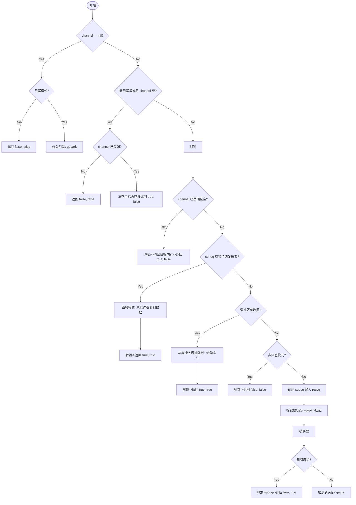
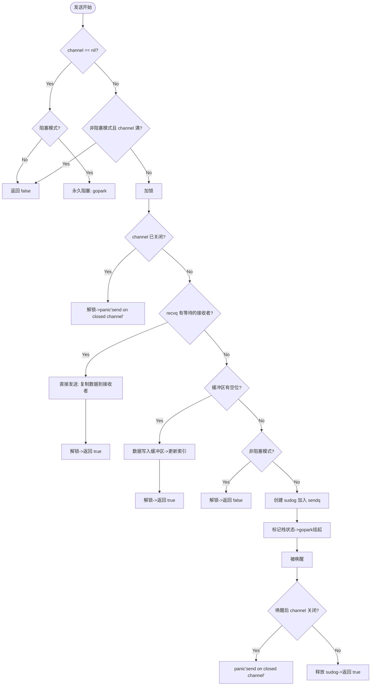

# channel

channel是go的并发原语之一，也是基于CSP的思想实现的，强调 goroutine 通过 Channel 传递数据而非直接操作共享内存。

该设计理念旨在通过提供一个安全、高效、灵活的通信机制，消除数据竞争风险，简化并发逻辑。


> go version go 1.23.1

## channel数据结构

> 源码位置：src/runtime/chan.go

```go
type hchan struct {
	qcount   uint           // 环形队列中现存元素数量
	dataqsiz uint           // 环形队列的容量
	buf      unsafe.Pointer // 环形队列头指针
	elemsize uint16         // 元素大小
	closed   uint32         // channel是否关闭
	timer    *timer
	elemtype *_type // 元素类型
    
    recvx    uint   // 队列已接收位置索引
    sendx    uint   // 队列已发送位置索引
    recvq    waitq  // 接收等待队列
    sendq    waitq  // 发送等待队列
    
	lock mutex
}
```

核心字段解析：

1.  `recvq` 是接收等待队列，当接收操作因 channel 无数据而阻塞时，goroutine 会被加入到这个队列中；

    *   **无缓冲channel**：接收操作` <-ch` 执行时，若当前无发送者准备就绪，接收的goroutine阻塞并加入`recvq`中

    *   **有缓冲channel**：缓冲区为空时(当前队列中没元素)，执行接收操作` <-ch`的goroutine会加入`recvq`中

    *   **nil channel**：对 `nil channel` 的接收操作会永久阻塞，不会panic，goroutine会被加入`recvq`中（尽管实际无唤醒可能）

2.  `sendq` 是发送等待队列，当发送操作因 `channel` 已满而阻塞时，`goroutine`会被加入到这个队列中；

    *   **无缓冲channel**：发送操作` chan <- x` 执行时，若当前无接收者准备就绪，发送的goroutine阻塞并加入`sendq中`

    *   **有缓冲channel**：缓冲区满时，执行发送操作的goroutine会加入`sendq`中

    *   **nil channel**：向 `nil channel` 发送数据操作会永久阻塞，goroutine会被加入到 `sendq` 中（同样无唤醒可能）

    *   **已关闭 channel**：会触发 panic，不会加入到 `sendq` 中

3.  `recvq` 和 `sendq` 都是双向链表实现的 FIFO 队列

4.  buf使用 ring buffer（环形队列缓存区），buf的unsafe.Pointer指向队列的头指针，结合`recvx`和`sendx`两个游标操作这个队列

### waitq 和 sudog

```go
type waitq struct {
	first *sudog
	last  *sudog
}

type sudog struct {
	g *g // 绑定 goroutine

	next *sudog // 下一个节点
	prev *sudog // 上一个节点
	elem unsafe.Pointer

	acquiretime int64
	releasetime int64
	ticket      uint32

     // isSelect = true 表示 g（协程） 正在参与 select，阻塞在多个 chan 中
    // select 只能通过一个 case，所以需要使用 g.selectDone 标志已经有 case 通过了
    // 其余 case 可以从等待列表中删除了，g.selectDone 必须经过 CAS 才能执行成功。
	isSelect bool

	success bool // 表示通道c通信是否成功。

	waiters uint16

	parent   *sudog // semaRoot binary tree
	waitlink *sudog // g.waiting list or semaRoot
	waittail *sudog // semaRoot
	c        *hchan // 绑定 channel
}
```

waitq 为 goroutine 等待队列，底层是由 sudog 数据结构的双向链表实现的。first 为队列头部，last 为队列尾部；

sudog是对 goroutine 和 channel 对应关系的一层封装抽象，以便于 goroutine 可以同时阻塞在不同的 channel 上，其中 elem 用于读取/写入 channel 的数据的容器。sudog 中所有字段都受 `hchan.lock` 保护；

## 创建chan


可以看到运行时创建channel的核心实现是`makechan`函数，无论创建的是否为有缓冲通道都调用该函数创建一个chan；

函数签名：

```go
func makechan(t *chantype, size int) *hchan
```

*   **`t *chantype`**：描述channel元素的类型信息
*   **`size int`**：缓冲区容量（若为0则创建无缓冲channel）
*   **返回值**：指向`hchan`结构体的指针

> 源码位置：src/runtime/chan.go  73

```go
func makechan(t *chantype, size int) *hchan {
	elem := t.Elem

	if elem.Size_ >= 1<<16 {
		throw("makechan: invalid channel element type")
	}
	if hchanSize%maxAlign != 0 || elem.Align_ > maxAlign {
		throw("makechan: bad alignment")
	}

    // 计算通道缓冲区所需的总内存大小(缓冲区总内存 = 单元素大小 × 缓冲区容量)
    // elem.Size_: 单个元素的大小(字节)
    // size: 用户指定的缓冲区容量
	mem, overflow := math.MulUintptr(elem.Size_, uintptr(size))
	if overflow || mem > maxAlloc-hchanSize || size < 0 {
		panic(plainError("makechan: size out of range"))
	}

	var c *hchan
	switch {
	case mem == 0: // 无缓冲区或零大小元素
        // 仅分配hchan结构体内存（无额外缓冲区）
		c = (*hchan)(mallocgc(hchanSize, nil, true))
		c.buf = c.raceaddr()
        
	case !elem.Pointers(): // 元素不含指针
        // 一次性分配连续内存：hchan结构体 + 缓冲区数组
        // 优势：减少内存碎片，提升访问效率
		c = (*hchan)(mallocgc(hchanSize+mem, nil, true))
		c.buf = add(unsafe.Pointer(c), hchanSize)
        
	default: // 元素包含指针
        // 分别分配：hchan结构体单独分配，缓冲区独立分配
		c = new(hchan)
		c.buf = mallocgc(mem, elem, true)
        
	}

	c.elemsize = uint16(elem.Size_)
	c.elemtype = elem
	c.dataqsiz = uint(size)
	lockInit(&c.lock, lockRankHchan)

	if debugChan {
		print("makechan: chan=", c, "; elemsize=", elem.Size_, "; dataqsiz=", size, "\n")
	}
	return c
}
```

主要逻辑是根据计算出的通道缓冲区所需的总内存大小不同区分了三种不同的分配策略，主要设计要点的性能影响如下：

1.  **内存布局优化**
    *   非指针元素采用连续内存，提升缓存局部性。
    *   指针元素分离分配，避免GC扫描干扰。
2.  **无锁与同步机制**
    *   无缓冲区channel依赖`sendq/recvq`实现直接协程间数据传递（handoff），减少拷贝。
    *   有缓冲区channel通过环形队列降低锁竞争频率。
3.  **创建开销考量**
    *   小型channel创建成本低（仅`hchan`结构体）。
    *   大型缓冲区或指针元素需两次内存分配，可能成为性能瓶颈。

## 从channel中接收数据

将代码翻译为汇编指令可以发现：

```go
tmp := <-ch1
     |
CALL    runtime.chanrecv1(SB)


tmp, ok := <-ch1
      |
CALL    runtime.chanrecv2(SB)
```

```go
//go:nosplit
func chanrecv1(c *hchan, elem unsafe.Pointer) {
	chanrecv(c, elem, true)
}

//go:nosplit
func chanrecv2(c *hchan, elem unsafe.Pointer) (received bool) {
	_, received = chanrecv(c, elem, true)
	return
}

func chanrecv(c *hchan, ep unsafe.Pointer, block bool) (selected, received bool) {
	if debugChan {
		print("chanrecv: chan=", c, "\n")
	}

    // 检查 chan 是否为nil
	if c == nil {
		if !block {
                // 非阻塞直接返回 false,false
			return
		}
          // 挂起当前 goroutine，永久阻塞(从nil chan中接收数据会永久阻塞)
		gopark(nil, nil, waitReasonChanReceiveNilChan, traceBlockForever, 2)
		throw("unreachable")
	}
    
    ...

    // 非阻塞模式下的检查, chan 是否满足接收操作
	if !block && empty(c) {
        // 未关闭且无数据, 返回 false false
		if atomic.Load(&c.closed) == 0 {
			return
		}
        // 若已关闭则清理内存并返回(true, false)
		if empty(c) {
			if raceenabled {
				raceacquire(c.raceaddr())
			}
			if ep != nil {
				typedmemclr(c.elemtype, ep)
			}
			return true, false
		}
	}
    
    var t0 int64
	if blockprofilerate > 0 {
		t0 = cputicks()
	}

    // 先加锁保证线程安全
	lock(&c.lock)

    // 再次验证channel的状态
	if c.closed != 0 { // 若已关闭且为空
		if c.qcount == 0 {
			if raceenabled {
				raceacquire(c.raceaddr())
			}
			unlock(&c.lock) // 解锁
			if ep != nil {
				typedmemclr(c.elemtype, ep) // 根据元素类型清空内存
			}
			return true, false 
		}
    } else { // 若未关闭且等待发送队列中有值(有阻塞的发送者), 则调用recv()函数完成同步接收
		if sg := c.sendq.dequeue(); sg != nil {
			recv(c, sg, ep, func() { unlock(&c.lock) }, 3)
			return true, true
		}
	}

    // 若chan未关闭且没有阻塞的发送者且缓冲区中有值, 则从缓冲区中接收数据(数据从buf中出队)
	if c.qcount > 0 {
        // 从缓冲区中取出一个
		qp := chanbuf(c, c.recvx)
		if raceenabled {
			racenotify(c, c.recvx, nil)
		}
		if ep != nil {
            // 将从缓冲区中取出的数据拷贝到内存中
			typedmemmove(c.elemtype, ep, qp)
		}
        // 清除队列中数据
		typedmemclr(c.elemtype, qp)
		c.recvx++
		if c.recvx == c.dataqsiz {
			c.recvx = 0
		}
		c.qcount--
		unlock(&c.lock)
		return true, true
	}

    // 若为非阻塞接收, 则直接return
	if !block {
		unlock(&c.lock)
		return false, false
	}

    // 否则就进行阻塞接收
	gp := getg() // 获取当前 goroutine
	mysg := acquireSudog() // 创建 sudog
	mysg.releasetime = 0
	if t0 != 0 {
		mysg.releasetime = -1
	}
	mysg.elem = ep // 绑定接收地址
	mysg.waitlink = nil
	gp.waiting = mysg // 标记等待状态

	mysg.g = gp  // 绑定当前 goroutine
	mysg.isSelect = false
	mysg.c = c
	gp.param = nil
	c.recvq.enqueue(mysg) // 加入接收队列
	if c.timer != nil {
		blockTimerChan(c)
	}

    // 标记栈状态防止收缩
	gp.parkingOnChan.Store(true)
	gopark(chanparkcommit, unsafe.Pointer(&c.lock), waitReasonChanReceive, traceBlockChanRecv, 2) // 挂起当前 goroutine，释放锁

    // 唤醒后的处理
    // 唤醒后继续执行
	if mysg != gp.waiting {
		throw("G waiting list is corrupted")
	}
	if c.timer != nil {
		unblockTimerChan(c)
	}
	gp.waiting = nil
	gp.activeStackChans = false
	if mysg.releasetime > 0 {
		blockevent(mysg.releasetime-t0, 2)
	}
	success := mysg.success  // 是否成功接收
	gp.param = nil
	mysg.c = nil
	releaseSudog(mysg) // 释放 sudog
	return true, success
}
```

核心还是会调用`runtime.chanrecv` ，几个参数和返回值含义：

*   **`c hchan`** 目标channel的指针，包含channel的状态（缓冲区、等待队列等）
*   **`ep unsafe.Pointer`** 接收数据的写入地址。若为`nil`，表示调用方仅检查channel状态（如`select`中的空接收语句）
*   **`block bool`** 是否阻塞。`true`表示阻塞等待数据；`false`表示非阻塞（用于`select`）

返回值：

*   `selected`：操作是否成功执行（阻塞模式下恒为`true`）
*   `received`：是否接收到有效数据（若channel关闭则返回`false`）

基本流程图：



## 发送数据到channel


可以看到发送数据到channel对应底层调用的方法是`runtime.chansend1`：

```go
// entry point for c <- x from compiled code.
//
//go:nosplit
func chansend1(c *hchan, elem unsafe.Pointer) {
	chansend(c, elem, true, getcallerpc())
}
```

`chansend1` 只是调用了 `chansend`函数，调用时将 block 参数设置成了 true 表示这个发送操作是阻塞的：

```go
func chansend(c *hchan, ep unsafe.Pointer, block bool, callerpc uintptr) bool {
    // 1. 常规检查
	if c == nil {
		if !block {
			return false
		}
        
          // 挂起当前 goroutine，永久阻塞
          // 向一个nil chan 发送数据会造成死锁
		gopark(nil, nil, waitReasonChanSendNilChan, traceBlockForever, 2)
		throw("unreachable")
	}
    
    ...

	if raceenabled {
		racereadpc(c.raceaddr(), callerpc, abi.FuncPCABIInternal(chansend))
	}

	if !block && c.closed == 0 && full(c) {
        // full为ture的两种情况:
        // 1.无缓存通道，recvq为空
        // 2.缓存通道，但是buffer已满
        
        // 所以向一个没有准备好接收操作的chan做非阻塞发送操作会直接return
		return false
	}

	var t0 int64
	if blockprofilerate > 0 {
		t0 = cputicks()
	}

	lock(&c.lock)

    // 2. 处理同步发送
    
    // 检查chan是否已关闭, 向一个已关闭的chan发送数据会panic
	if c.closed != 0 {
		unlock(&c.lock)
		panic(plainError("send on closed channel"))
	}
    
    // 若等待接收队列中有等待的goroutine, 则调用send函数同步处理发送
	if sg := c.recvq.dequeue(); sg != nil {
        // send 会调 goready() 唤醒那个阻塞等待接收的goroutine(将状态从 Gwaiting 或者 Gscanwaiting 改变成 Grunnable, 下一轮调度时会唤醒这个接收的 goroutine)
		send(c, sg, ep, func() { unlock(&c.lock) }, 3)
		return true
	}

    // 3. 处理异步发送
    
    // 若为有缓冲chan, 且缓冲区未满
	if c.qcount < c.dataqsiz {
        // 获取下一个可放置缓冲数据的 buf 地址
        // 从缓冲区中取出数据
		qp := chanbuf(c, c.sendx) 
		if raceenabled {
			racenotify(c, c.sendx, nil)
		}
        
        // 将从缓冲区中取出的数据拷贝到缓冲区
		typedmemmove(c.elemtype, qp, ep)
        
        // 更新游标
		c.sendx++ // 发送索引+1
		if c.sendx == c.dataqsiz {
			c.sendx = 0
		}
         // 缓冲区数量+1
		c.qcount++
         // 解锁
		unlock(&c.lock)
		return true
	}

	if !block {
        // 非阻塞 + 缓冲区没有空闲空间可以使用 - 解锁、返回失败
		unlock(&c.lock)
		return false
	}

    // 4. 阻塞发送
    // 出现的情况：阻塞发送 && buf 没有空闲空间
    
    // 将goroutine休眠与数据等封装为sudog入sendq队列
	gp := getg()
	mysg := acquireSudog()
	mysg.releasetime = 0
	if t0 != 0 {
		mysg.releasetime = -1
	}

	mysg.elem = ep
	mysg.waitlink = nil
	mysg.g = gp
	mysg.isSelect = false
	mysg.c = c
	gp.waiting = mysg
	gp.param = nil
	c.sendq.enqueue(mysg)

	gp.parkingOnChan.Store(true)
    // 挂起当前 goroutine，释放锁
	gopark(chanparkcommit, unsafe.Pointer(&c.lock), waitReasonChanSend, traceBlockChanSend, 2)

	KeepAlive(ep)

    
    // 5. 唤醒后的处理
    // 唤醒后继续执行
	if mysg != gp.waiting {
		throw("G waiting list is corrupted")
	}
	gp.waiting = nil
	gp.activeStackChans = false
	closed := !mysg.success
	gp.param = nil
	if mysg.releasetime > 0 {
		blockevent(mysg.releasetime-t0, 2)
	}
	mysg.c = nil
	releaseSudog(mysg)
	if closed {
		if c.closed == 0 {
			throw("chansend: spurious wakeup")
		}
		panic(plainError("send on closed channel"))
	}
	return true
}
```

`send` 函数用于处理将发送到channel的数据发送到等待接收队列中：

1.  拷贝数据到接收方
2.  取出接收方goroutine然后唤醒它

```go
// sg 表示接收方 goroutine
// ep 表示要发送的数据
func send(c *hchan, sg *sudog, ep unsafe.Pointer, unlockf func(), skip int) {
    // 数据不空就拷贝数据
    if sg.elem != nil {
		sendDirect(c.elemtype, sg, ep)
		sg.elem = nil
	}
        
    // 从 sudog 获取 goroutine
	gp := sg.g
    // 解锁 hchan （结合 chansend 函数加锁）
	unlockf()
	gp.param = unsafe.Pointer(sg)
    // 设置接收成功
	sg.success = true
	if sg.releasetime != 0 {
		sg.releasetime = cputicks()
	}
    
    // 调用 goready 函数将接收方 goroutine 唤醒并标记为可运行状态
	goready(gp, skip+1)
}

func sendDirect(t *_type, sg *sudog, src unsafe.Pointer) {
    dst := sg.elem
    // ...

    // 拷贝数据
	memmove(dst, src, t.size)
}
```

基本流程图：



## 关闭channel


```go
func closechan(c *hchan) {
    // 1. 常规检查
    
    // 关闭一个已关闭的chan会panic
	if c == nil {
		panic(plainError("close of nil channel"))
	}

	lock(&c.lock)
    // 关闭一个已关闭的chan也会panic
	if c.closed != 0 {
		unlock(&c.lock)
		panic(plainError("close of closed channel"))
	}
    
    ...

    // 关闭标志设为1
	c.closed = 1

    
    // 2. 释放内存资源
	var glist gList

    // 回收等待接收队列中的g, 将其加到glist中
	for {
		sg := c.recvq.dequeue()
		if sg == nil {
			break
		}
		if sg.elem != nil {
			typedmemclr(c.elemtype, sg.elem)
			sg.elem = nil
		}
		if sg.releasetime != 0 {
			sg.releasetime = cputicks()
		}
		gp := sg.g
		gp.param = unsafe.Pointer(sg)
		sg.success = false
		if raceenabled {
			raceacquireg(gp, c.raceaddr())
		}
		glist.push(gp)
	}

    // 回收等待发送队列中的g, 将其加到glist中
	for {
		sg := c.sendq.dequeue()
		if sg == nil {
			break
		}
		sg.elem = nil
		if sg.releasetime != 0 {
			sg.releasetime = cputicks()
		}
		gp := sg.g
		gp.param = unsafe.Pointer(sg)
		sg.success = false
		if raceenabled {
			raceacquireg(gp, c.raceaddr())
		}
		glist.push(gp)
	}
	unlock(&c.lock)

	// 调用goready为glist中所有goroutine触发调度,状态从 _Gwaiting 设置为 _Grunnable 状态，等待调度器的调度
	for !glist.empty() {
		gp := glist.pop()
		gp.schedlink = 0
		goready(gp, 3)
	}
}
```

## 总结

channel的基本操作规则：

| 行为 \ 状态 |  nil  | 已关闭的chan | 正常的chan |
| :---------: | :---: | :----------: | :--------: |
|    关闭     | panic |    panic     |    成功    |
|    写入     | 死锁  |    panic     | 阻塞或成功 |
|    读取     | 死锁  |     零值     | 阻塞或成功 |

优点：

channel是一种并发安全的原语，支持多种数据类型的消息传递，使用channel可以解耦生产者和消费者，使得生产者和消费者之间的交互可以更加高效和灵活；

侧重点和解决了的问题：
...