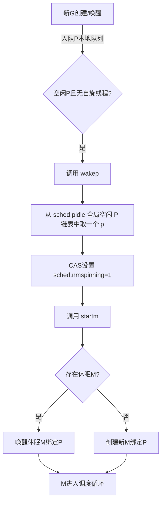
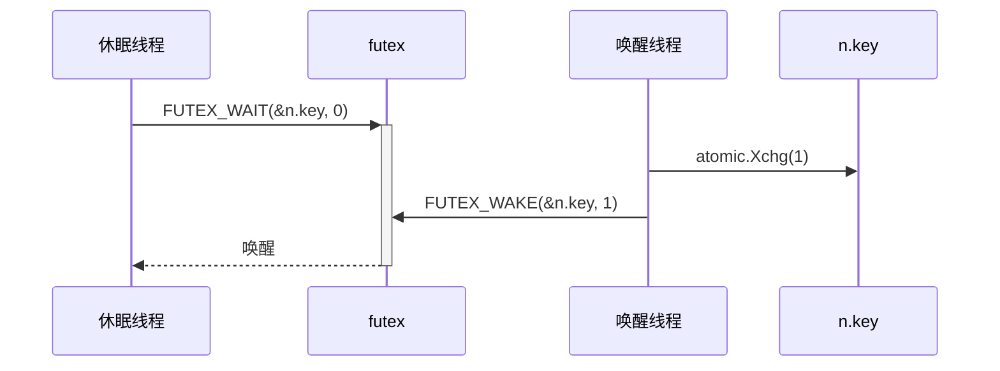
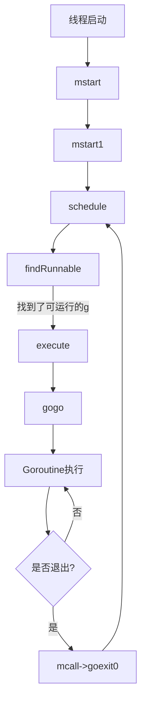

# 大致学习框架

*   goroutine的调度方式 --- GMP模型
*   goroutine的通信方式 --- channel机制
*   goroutine的内存管理
*   select的特性、优先级问题、如何优雅的关闭goroutine
*   工具分析(pprof、trace) --- goroutine堆栈、协程阻塞、锁
*   GC与goroutine的关系，哪些情况下会触发GC
*   goroutine 与 lua corountine 的比较

# 1. Go协程与调度器

## 1.1 协程、进程与线程

在仅支持进程的操作系统中，进程是拥有资源和独立调度的基本单位。在引入线程的操作系统中，线程是独立调度的基本单位，进程是资源拥有的基本单位。在同一进程中，线程的切换不会引起进程切换。 在不同进程中进行线程切换，如从一个进程内的线程切换到另一个进程中的线程时，会引起进程切换。

进程/线程提供并发能力的同时也存在着一些缺点：

1.  进程、线程都拥有着很多的资源，它们的创建、切换和销毁都会占用大量的 CPU 资源；
2.  在如今的高并发业务场景下，为每一个任务创建一个线程是不现实的，每个线程大约需要 4MB 内存，大量的线程会导致高内存占用问题。

基于以上问题，于是便产生了协程，在Go中协程被称为 goroutine，是Go语言实现的用户态线程，具有以下特点：

*   相比线程，其启动的代价很小，以很小栈空间启动（2Kb左右）
*   能够动态地伸缩栈的大小，最大可以支持到Gb级别
*   工作在用户态，切换成很小
*   与线程关系是n:m，即可以在n个系统线程上多工调度m个Goroutine

<br>

## 1.2 Goroutine与线程的映射

N : 1 关系

优点：

*   N个协程绑定1个线程，优点就是协程在用户态线程即完成切换，不会陷入到内核态，这种切换非常的轻量快速。

缺点：

*   一个进程的所有协程都绑定在一个线程上
*   某个程序用不了硬件的多核加速功能
*   一旦某个协程阻塞，造成线程阻塞，本进程的其他协程都会无法执行，根本没有并发能力

<br>
1 : 1 关系
优点：

*   一个协程绑定一个线程，容易实现，有一定的并发能力

缺点：

*   协程的创建、删除和切换的代价都由CPU完成，退化成基于线程的并发了

<br>
M : N 关系

是 N:1 和 1:1 类型的结合，克服了这两种模型的缺点，但协程调度器实现起来最复杂

<br>

## 1.3. Golang协程调度器

### 1.3.1 GM调度模型

因性能问题被废弃的调度器

*   G：goroutine协程
*   M：Machine，代表一个操作系统内核线程


GM 模型使用全局唯一的 goroutine 运行队列，对所有 goroutine 进行管理和调度，线程（M)通过对全局运行队列加锁的方式，对 G 进行获取和执行，该模型存在以下缺点：

1.  所有G操作(G的创建、调度)依赖全局队列，**高频加锁导致性能骤降**）；
2.  新创建的 G 强制入全局队列，无法保证在产生它的 M 中执行，无法保存 M 的上下文环境(每个 M 都需要处理内存缓存，导致大量的内存占用并影响数据局部性)，跨 M 调度延迟高， M 会频繁交接 G，导致额外开销、性能下降；
3.  M 阻塞时关联 G 全部停滞，CPU 闲置；
4.  M 数量无约束，存在线程爆炸风险；

<br>

### 1.3.2 GMP调度模型


注：**KSE是Kernel Scheduling Entity的缩写，其是可被操作系统内核调度器调度的对象实体，是操作 系统内核的最小调度单元，可以简单理解为内核级线程。**

G-M-P分别代表：

*   G - Goroutine，Go协程，是参与调度与执行的最小单位
*   M - Machine，表一个操作系统内核线程(KSE)
*   P - Processor，指的是逻辑处理器，P关联了的本地可运行G的队列(也称为LRQ)，最多可存放256个G。

```go
type p struct { 
    ... 

    // 本地可运行的队列，不用通过锁即可访问 
    runqhead uint32  // 队头 
    runqtail uint32  // 队尾 
    runq     [256]guintptr // (p的本地队列)使用数组实现的循环队列,大小256

    ... 
}
```

在 GMP 中，线程是运行 G 的实体，调度器的功能是把可运行的 G 分配到工作线程上。

1.  全局队列（GRQ）：存放等待运行的 G。
2.  本地队列（LRQ）：存放与之关联 P 的等待运行的 G，256个；新建 G 优先放到 LRQ 中。
3.  P 列表：所有 P 在程序启动时根据 GOMAXPROCS 配置的数量创建，并保存到切片中。
4.  M：运行 G的实体，与内核线程和 P 关联，最多同时有 P 个 M 在同时运行，其余 M 处于休眠状态。

**高效调度的核心机制：**

1.  本地队列与锁优化

    *   P的LRQ使大部分调度无需访问全局队列，**减少全局锁竞争**（GM模型的主要瓶颈）；
    *   新G优先加入当前P的LRQ，若LRQ满则转移一半G到GRQ，保持本地化调度；

2.  Work Stealing（任务窃取）

    *   当P的LRQ为空时，M不会空转，而是**从其他P的LRQ偷取50%的G**，最大化CPU利用率；

3.  Hand Off（切换移交）

    *   G阻塞于系统调用时，M释放P并进入阻塞状态，由其他空闲M接管P继续运行LRQ中的G，**避免线程阻塞导致资源闲置**；

4.  协作式抢占

    *   每个G最多占用CPU 10ms，**通过信号强制抢占**，防止长任务饿死其他G（GM模型依赖主动让出）；

5.  复用机制

    *   线程复用：M执行完G后尝试窃取任务，而非立即销毁；**空闲M优先绑定P执行新任务**，减少线程创建开销；
    *   G复用：退出的G会被放到全局gFree列表中，下次创建会优先从这个列表中获取；

**与GM的本质区别**：GMP通过引入P层，将**全局竞争拆分为本地调度+全局协调**，从“中心化调度”升级为“分布式调度”，这是其支撑百万级Goroutine并发的核心。

# 2. 数据结构

> 注：以下所有源码都是基于go1.23.1

## 2.1 schedt 结构体和全局变量

schedt结构体是调度器的全局核心数据结构，负责协调所有G（goroutine）、M（内核线程）和P（处理器）的资源分配与状态管理。

> 源码位置：src/runtime/runtime2.go 775

```go
type schedt struct {
	...
    
	lastpoll  atomic.Int64 // 上次网络轮询的时间，如果当前轮询则为 0
	pollUntil atomic.Int64 // 当前轮询休眠的时间

	lock mutex // 保护调度器全局状态的互斥锁，操作全局队列时必须持有此锁
    
	midle        muintptr // 空闲 m 的链表（未绑定P的线程）
	nmidle       int32    // 空闲的 m 数量
	nmidlelocked int32    // 空闲的且被 lock 的 m 计数
	mnext        int64    // 已创建的 m 的数量和下一个 mid
	maxmcount    int32    // 表示最多所能创建的 m 数量
	nmsys        int32    // 不计入死锁的系统 m 数量
	nmfreed      int64    // 释放的 m 的累积数量

	ngsys atomic.Int32 // 系统 goroutine 数量

	pidle        puintptr // 由空闲的 p 结构体对象组成的链表，pidle 表示头指针（未绑定 m）
	npidle       atomic.Int32 // 空闲的 p 结构体对象的数量
    
    // 关于自旋 m 的数量，唤醒 P 的关键条件
	nmspinning   atomic.Int32  // 自旋 m 的数量（正在寻找G的线程，避免频繁休眠，不绑定 p，但持续尝试窃取任务（Work-Stealing））
	needspinning atomic.Uint32 // 标识当前是否需要触发一个新自旋线程，触发条件：当新任务提交时，若同时满足：存在空闲的p && sched.nmspinning == 0

	// 存储所有P共享的任务（当P本地队列满时G会进入此队列）（访问时需加锁保护）
	runq     gQueue // 全局可运行的 G 队列
	runqsize int32 // 全局可运行的 G 队列元素数量

    ...
    
	// Global cache of dead G's.
    // gFree 是所有已经退出的 goroutine 对应的 g 结构体对象组成的链表
    // 用于缓存可复用的 g 结构体对象，避免每次创建 goroutine 时都重新分配内存
    // 访问时需加锁保护
	gFree struct {
		lock    mutex
		stack   gList // Gs with stacks
		noStack gList // Gs without stacks
		n       int32
	}
    
    sysmonwait atomic.Bool // 标记sysmon监控线程是否在休眠（通过atomic操作）

	...
}

// gQueue 是通过 g.schedlink 链接的 G 的出队。
// 一个 G 一次只能位于一个 gQueue 或 gList 上。
type gQueue struct {
	head guintptr
	tail guintptr
}
```

**schedt的全局资源协调机制：**

*   **空闲G复用**： 当goroutine退出时，其内存不会被立即释放，而是通过`sched.gFree`链表缓存，供后续`newproc`创建G时复用，**减少内存分配开销**；
*   **P的动态分配**： 空闲P通过`sched.pidle`链表管理。当M需要绑定P时，优先从此链表获取；M释放P时将其回收到链表，实现**处理器资源的动态调配**；
*   **M的自旋优化**： `sched.nmspinning`统计自旋M的数量。自旋M会短暂占用CPU寻找可运行的G，避免线程频繁休眠与唤醒，**提升高并发场景的响应速度**；
*   **全局队列（runq）** ： 当P的本地队列（容量256）已满时，新创建的G会被放入`sched.runq`全局队列。M在本地队列为空时，会加锁从全局队列批量获取G（每次最多获取`len(runq)/GOMAXPROCS + 1`个）；
*   **偷取任务（Work-Stealing）** ： 若全局队列也为空，M会从其他P的本地队列偷取一半的G（通过`stealWork`函数实现），**避免部分P过载而其他P闲置**；

<br>

**schedt的初始化与访问流程：**

*   **设置最大M数**：`sched.maxmcount = 10000`
*   **初始化P数量**：根据`GOMAXPROCS`环境变量或CPU核心数创建P，并调用`procresize`分配初始P
*   **构建空闲链表**：初始化`sched.gFree`、`sched.pidle`等链表为空的初始状态

<br>

在程序初始化时，这些全变量都会被初始化为 0 值，指针会被初始化为 nil 指针，切片初始化为 nil 切片，int 被初始化为数字 0，结构体的所有成员变量按其本类型初始化为其类型的 0 值。所以程序刚启动时 allgs，allm 和 allp 都不包含任何 g、m 和 p。

```go
var (
	allglen     uintptr  // 所有 g 的长度
	allgs       []*g     // 保存所有的 g
	allm        *m       // 所有的 m 构成的一个链表，包括下面的 m0
	allp        []*p     // 保存所有的 p，len(allp) == gomaxprocs

	ncpu       int32   // 系统中 cpu 核的数量，程序启动时由 runtime 代码初始化
	gomaxprocs int32   // p 的最大值，默认等于 ncpu，但可以通过 GOMAXPROCS 修改

	sched      schedt  // 调度器结构体对象，记录了调度器的工作状态

	m0  m        // m0 代表进程的主线程
	g0  g        // m0的g0，也就是m0.g0 = &g0
)
```

<br>

## 2.2 g 结构体

在Go语言的GMP调度模型中，**g（goroutine）结构体**是协程的实体表示，存储了协程的运行状态、栈信息、调度上下文等关键数据。其核心字段和功能如下：

> 源码位置：src/runtime/runtime2.go 422

```go
// runtime/runtime2.go
type g struct {
   // 记录协程栈的栈顶和栈底位置
   stack       stack   // offset known to runtime/cgo
   // 主要作用是参与一些比较计算，当发现容量要超过栈分配空间后，可以进行扩容或者收缩
   stackguard0 uintptr // offset known to liblink
   stackguard1 uintptr // offset known to liblink
    
   ...

   // 当前与g绑定的m
   m         *m      // current m; offset known to arm liblink
   // 这是一个比较重要的字段，里面保存的一些与goroutine运行位置相关的寄存器和指针，如rsp、rbp、rpc等寄存器
   sched     gobuf
   syscallsp uintptr // if status==Gsyscall, syscallsp = sched.sp to use during gc
   syscallpc uintptr // if status==Gsyscall, syscallpc = sched.pc to use during gc
   syscallbp uintptr // if status==Gsyscall, syscallbp = sched.bp to use in fpTraceback
   stktopsp  uintptr // expected sp at top of stack, to check in traceback

   // 用于做参数传递，睡眠时其他goroutine可以设置param，唤醒时该g可以读取这些param
   param        unsafe.Pointer
   // 记录当前goroutine的状态
   atomicstatus uint32
   stackLock    uint32 // sigprof/scang lock; TODO: fold in to atomicstatus
   // goroutine的唯一id
   goid         int64
   // schedlink字段指向全局运行队列中的下一个g，
   //所有位于全局运行队列中的g形成一个链表
   schedlink    guintptr
    
   ...

   // 标记是否可以被抢占
   preempt       bool // preemption signal, duplicates stackguard0 = stackpreempt
   preemptStop   bool // transition to _Gpreempted on preemption; otherwise, just deschedule
   preemptShrink bool // shrink stack at synchronous safe point
    
   ...

   // 如果调用了LockOsThread方法，则g会绑定到某个m上，只在这个m上运行
   lockedm        muintptr
   sig            uint32
   writebuf       []byte
   sigcode0       uintptr
   sigcode1       uintptr
   sigpc          uintptr
   parentGoid     uint64          // goid of goroutine that created this goroutine
   // 创建该goroutine的语句的指令地址
   gopc           uintptr         // pc of go statement that created this goroutine
   ancestors      *[]ancestorInfo // ancestor information goroutine(s) that created this goroutine (only used if debug.tracebackancestors)
   // goroutine函数的指令地址
   startpc        uintptr         // pc of goroutine function
   racectx        uintptr
   waiting        *sudog         // sudog structures this g is waiting on (that have a valid elem ptr); in lock order
   cgoCtxt        []uintptr      // cgo traceback context
   labels         unsafe.Pointer // profiler labels
   timer          *timer         // cached timer for time.Sleep
   sleepWhen      int64          // when to sleep until
   selectDone     uint32         // are we participating in a select and did someone win the race?
    
   ...
}
```

几个关键的字段解释：

*   stack是协程栈的地址信息，需要注意的是m0绑定的g0是在进程被分配的系统栈上分配协程栈的，而其他协程栈都是在堆上进行分配的；

```go
// goroutine协程栈的栈顶和栈底
type stack struct {
	lo uintptr
	hi uintptr
}
```

*   gobuf中保存了协程执行的上下文信息，这里也可以看到协程切换的上下文信息极少；sp代表cpu的rsp寄存器的值，pc代表CPU的rip寄存器值、bp代表CPU的rbp寄存器值；ret用来保存系统调用的返回值，ctxt在gc的时候使用；利用 gobuf 可以完成 goroutine 在 CPU 的切换；
    *   SP：永远指向栈顶位置
    *   BP：某一时刻的栈顶位置，当新函数调用时，把当前SP地址赋值给BP、SP指向新的栈顶位置
    *   PC：代表代码经过编译为机器码后，当前执行的机器指令（可以理解为当前语句）

```go
// gobuf中保存了非常重要的上下文执行信息，
type gobuf struct {
    sp   uintptr // 代表cpu的rsp寄存器的值(永远指向栈顶位置)
    pc   uintptr // 保存cpu的rip寄存器的值(下一条运行指令地址)
    g    guintptr // 指向所保存执行上下文的goroutine
    ctxt unsafe.Pointer    // gc时候使用
    
    // 保存系统调用的返回值，因为从系统调用返回之后如果 p 被其它工作线程抢占，
    // 则这个 goroutine 会被放入全局运行队列被其它工作线程调度，其它线程需要知道系统调用的返回值。
    ret  uintptr
    lr   uintptr
    
    // 保存 CPU 的 rbp 寄存器的值
    // 某一时刻的栈顶位置，当新函数调用时，把当前SP地址赋值给BP、SP指向新的栈顶位置
    bp   uintptr // 对于支持帧指针的系统架构，才有用
}
```

*   atomicstatus 表示 goroutine 所处状态，状态解释如下：

| **g 状态（atomicstatus）** | **说明**                                                     | **触发场景**                                                 |
| -------------------------- | ------------------------------------------------------------ | ------------------------------------------------------------ |
| \_Gidle                    | 已分配内存但未初始化，尚未加入调度队列                       | `newproc1`创建新goroutine时的初始状态，随后转为`_Grunnable`  |
| \_Gdead                    | 未运行且无有效栈，可能已被回收或未初始化                     | goroutine退出后或被销毁时；新建时未初始化前也标记为此状态    |
| \_Grunnable                | 等待被调度执行，位于P的本地队列或全局队列中                  | goroutine创建完成、阻塞结束（如channel唤醒）、系统调用返回   |
| \_Grunning                 | 正在某个M上执行用户代码，拥有栈和CPU时间片                   | 被调度器选中执行时（通过`execute`函数切换状态）              |
| \_Gwaiting                 | 因运行时事件阻塞（如channel操作、锁、定时器），g不在运行队列中，被记录在其他等待队列中（如channel的等待队列中），需要ready才能被唤醒 | 执行`gopark`函数主动挂起（如`channel`收发阻塞、`sync.Mutex`锁竞争） |
| \_Gsyscall                 | 正在执行系统调用，与M绑定但未绑定P，M阻塞在系统调用里，g不在运行队列中 | 进入系统调用（如文件I/O、网络请求）时触发                    |
| \_Gpreempted               | g由于被抢占M，被重新塞回运行队列中                           | 行时间超过10ms被`sysmon`标记抢占                             |
| \_Gcopystack               | 需要扩容或者缩小 g 的栈空间，将协程的栈转移到新栈时的状态，没有执行用户代码，不在运行队列上，已经被分配给了 M，目前扩缩栈中，扩缩完成就可以继续执行用户代码 | 栈不足触发扩容（`stack.go`中的`newstack`函数）               |
| \_Gmoribund\_unused        | 当前此状态未使用                                             |                                                              |
| \_Genqueue\_unused         | 当前此状态未使用                                             |                                                              |

G 的状态变更图：


## 2.3 g 的创建

我们使用 go 关键字时，编译器会翻译成汇编代码调用 `runtime·newproc` 创建一个协程；

> 源码位置：src/runtime/proc.go 4974

```go
// Create a new g running fn.
// Put it on the queue of g's waiting to run.
// The compiler turns a go statement into a call to this.
func newproc(fn *funcval) {
	gp := getg()
	pc := getcallerpc() // 获取 newproc 函数调用者指令的地址
	systemstack(func() {
		newg := newproc1(fn, gp, pc) // 创建 G

		pp := getg().m.p.ptr() // 获取当前绑定的 p
		runqput(pp, newg, true) // 将 G 放入运行队列

		if mainStarted { // 如果main函数已经启动, 则需要唤醒一个p
			wakep()
		}
	})
}
```

使用 `systemstack` 函数切换到系统栈 (一般是g0栈) 中执行，执行完毕后切换回普通 g 的栈；
`newproc1` 函数是Go语言运行时系统中用于创建新 goroutine 的核心函数；负责初始化一个新的 `g` 结构体，并将其放入可运行队列等待调度执行；

> 源码位置：src/runtime/proc.go 4992

```go
// 在状态_Grunnable（如果parking为true，则为_Gwaiting）中创建一个新的g，从fn开始。
// 将创建的 g 加入到调度器中
// 参数:
// fn *funcval: 待执行的函数指针
// callergp *g: 调用方的goroutine
func newproc1(fn *funcval, callergp *g, callerpc uintptr, parked bool, waitreason waitReason) *g {
	if fn == nil {
		fatal("go of nil func value")
	}

    // 取当前 g0 绑定的 m, 并将对其上锁(禁止抢占，防止在分配过程中被调度打断)
    // 返回 m
	mp := acquirem()  
    
    // 取出 m 绑定的 p
	pp := mp.p.ptr()
    
    // 尝试从 p 的空闲列表获取一个空闲的 g, 若取不到则新建一个, 并添加到allg中
    // 尝试从 p 本地 gFree 或 schedt 结构中全局 gFree 中获取 Gdead 状态的 g
    // gFree 队列是所有已退出的 goroutine 对应的 g 结构体组成的链表, 用于缓存 g 结构体对象, 避免每次创建 goroutine 时都重新分配内存(复用减少内存分配)
	newg := gfget(pp)
	if newg == nil {
		newg = malg(stackMin) // 创建一个新的 g, 为其分配stackMin大小的栈空间
		casgstatus(newg, _Gidle, _Gdead) // 初始状态设为 _Gdead
		allgadd(newg) // 添加到全局 allg 列表，避免被 GC 回收
	}
    
    // 检查新创建的g的栈是否正常
	if newg.stack.hi == 0 {
		throw("newproc1: newg missing stack")
	}
	
    // 检查新创建的g的状态是否正常
	if readgstatus(newg) != _Gdead {
		throw("newproc1: new g is not Gdead")
	}

    totalSize := uintptr(4*goarch.PtrSize + sys.MinFrameSize) // 计算参数所需空间
    totalSize = alignUp(totalSize, sys.StackAlign)  // 按8字节对齐(64位操作系统)
	sp := newg.stack.hi - totalSize // 栈顶预留空间存放参数
    
    ...

    // 清除新分配的内存(两个参数:起始地址, 长度) ---> 快速初始化新g的sched空间
	memclrNoHeapPointers(unsafe.Pointer(&newg.sched), unsafe.Sizeof(newg.sched))
    
	newg.sched.sp = sp // 栈指针指向参数区顶部
	newg.stktopsp = sp
	newg.sched.pc = abi.FuncPCABI0(goexit) + sys.PCQuantum  // PC 指向 goexit 第二条指令
	newg.sched.g = guintptr(unsafe.Pointer(newg)) // 绑定自身 g 结构体
	gostartcallfn(&newg.sched, fn) // 伪造调用链：fn -> goexit
    
	newg.parentGoid = callergp.goid
	newg.gopc = callerpc // 记录创建者的调用位置（调试用）
	newg.ancestors = saveAncestors(callergp)  
	newg.startpc = fn.fn // 记录用户函数入口

    ...
    
    var status uint32 = _Grunnable
	if parked {
		status = _Gwaiting
		newg.waitreason = waitreason
	}
    casgstatus(newg, _Gdead, status) // 状态切换为可运行(_Grunnable)
    
    ...
    
    // 分配goid
	newg.goid = pp.goidcache
	pp.goidcache++
    
    ...
    
    // 将当前 m 的引用计数减1，解除当前 goroutine 与 m 的绑定关系，使该 m 可被其他 goroutine 复用, 与上面acquirem方法协作使用
	releasem(mp)

	return newg
}
```

`newg.sched.pc = abi.FuncPCABI0(goexit) + sys.PCQuantum`：`newg.sched.pc` 被设置成了 `goexit` 函数的第二条指令的地址而不是 `fn.fn`，具体原因要分析`gostartcallfn`函数：

```go
// adjust Gobuf as if it executed a call to fn
// and then stopped before the first instruction in fn.
func gostartcallfn(gobuf *gobuf, fv *funcval) {
	var fn unsafe.Pointer
	if fv != nil {
		fn = unsafe.Pointer(fv.fn)
	} else {
		fn = unsafe.Pointer(abi.FuncPCABIInternal(nilfunc))
	}
	gostartcall(gobuf, fn, unsafe.Pointer(fv))
}

// adjust Gobuf as if it executed a call to fn with context ctxt
// and then stopped before the first instruction in fn.
func gostartcall(buf *gobuf, fn, ctxt unsafe.Pointer) {
	sp := buf.sp // newg 的栈顶
	sp -= goarch.PtrSize // 栈顶向下移动 8 字节，用来存 return address
	*(*uintptr)(unsafe.Pointer(sp)) = buf.pc // return address =  goexit 函数的第二条指令的地址
	buf.sp = sp // 设置 buf.sp 指向新的栈顶
	buf.pc = uintptr(fn) // buf.pc 执行函数地址 fn，后边 g 被调度起来，会从这里开始执行
	buf.ctxt = ctxt 
}

```

gostartcallfn 函数首先从参数 fv 中提取出函数地址 fv.fn，然后继续调用 gostartcall 函数，gostartcall 函数的主要作用有两个：

1.  整 newg 的栈空间，把 goexit 函数的第二条指令的地址入栈，伪造成 goexit 函数调用了 fn 的假象，从而使 fn 执行完成后，执行 ret 指令时，返回到 goexit+1 处继续执行，完成最后的清理工作；
2.  重新设置 newg.buf.sp 指向新栈顶，设置 newg.buf.pc 为需要执行的函数的地址，即 fn，也就是 go 关键字后边的函数的地址。至此，一个可用的 goroutine 就创建好了。

<br>

调用 runqput 函数将 g 放入可运行队列，优先放入 p 的本地队列，本地队列满了，再放入全局可运行队列；如果 next = true，将 g 替换当前的 pp.runnext，然后将 pp.runnext 中原本的内容重新放入可运行队列：

> 源码位置：src/runtime/proc.go 6696

```go
// runqput tries to put g on the local runnable queue.
// If next is false, runqput adds g to the tail of the runnable queue.
// If next is true, runqput puts g in the pp.runnext slot.
// If the run queue is full, runnext puts g on the global queue.
// Executed only by the owner P.
func runqput(pp *p, gp *g, next bool) {
    // 引入调度的随机性
	if randomizeScheduler && next && fastrandn(2) == 0 {
		next = false
	}

	if next {
	retryNext:
        // 为了最大限度的保持局部优先性，gp 优先放入 pp.runnext 槽中
		oldnext := pp.runnext
		if !pp.runnext.cas(oldnext, guintptr(unsafe.Pointer(gp))) {
            // cas 保证操作的原子性
			goto retryNext
		}
        // 原本 runnext 值为 nil，所以没任何事情可做了，直接返回
		if oldnext == 0 {
			return
		}
		// Kick the old runnext out to the regular run queue.
        // //原本存放在 runnext 的 gp 需要放入 runq 的尾部
		gp = oldnext.ptr()
	}

retry:
    // 可能有其它线程正在并发修改 runqhead 成员，所以需要跟其它线程同步
	h := atomic.LoadAcq(&pp.runqhead) // load-acquire, synchronize with consumers
	t := pp.runqtail
    // 判断 p 的本地运行队列是否满了
	if t-h < uint32(len(pp.runq)) {
        // 队列还没有满，可以放入，尾部放入 gp
		pp.runq[t%uint32(len(pp.runq))].set(gp)
        
        // 虽然没有其它线程并发修改这个 runqtail，但其它线程会并发读取该值以及 p 的 runq 成员
        // 这里使用 StoreRel （汇编实现的）是为了：
        // 1.原子写入 runqtail
        // 2.防止编译器和 CPU 乱序，保证上一行代码对 runq 的修改发生在修改 runqtail 之前
        // 3.可见行屏障，保证当前线程对运行队列的修改对其它线程立马可见
		atomic.StoreRel(&pp.runqtail, t+1) // store-release, makes the item available for consumption
		return
	}
    // p 的本地运行队列已满，需要放入全局运行队列
	if runqputslow(pp, gp, h, t) {
		return
	}
    
	// the queue is not full, now the put above must succeed
	goto retry // 队列未满时，必须得执行成功
}
```

详解下`runqputslow`函数：

```go
// Put g and a batch of work from local runnable queue on global queue.
// Executed only by the owner P.
func runqputslow(pp *p, gp *g, h, t uint32) bool {
	var batch [len(pp.runq)/2 + 1]*g // gp 加上 p 本地队列的一半

	// First, grab a batch from local queue.
	n := t - h
	n = n / 2
	if n != uint32(len(pp.runq)/2) {
		throw("runqputslow: queue is not full")
	}
    // 取出 p 本地队列的一半
	for i := uint32(0); i < n; i++ {
		batch[i] = pp.runq[(h+i)%uint32(len(pp.runq))].ptr()
	}
	if !atomic.CasRel(&pp.runqhead, h, h+n) { // cas-release, commits consume
		// 这里存在并发，会有其他 p 过来偷 g
        // 如果 cas 操作失败，说明已经有其它工作线程
        // 从 p 的本地运行队列偷走了一些 goroutine
        // 所以直接返回，让 p 继续 retry 就行
        return false
	}
    
	batch[n] = gp

    // 增加调度的随机性，随机打乱一下顺序
	if randomizeScheduler {
		for i := uint32(1); i <= n; i++ {
			j := fastrandn(i + 1)
			batch[i], batch[j] = batch[j], batch[i]
		}
	}

	// Link the goroutines.
    // 全局运行队列是一个链表，这里首先把所有需要放入全局运行队列的 g 链接起来，
    // 减少后面对全局链表的锁住时间，从而降低锁冲突
	for i := uint32(0); i < n; i++ {
		batch[i].schedlink.set(batch[i+1])
	}
	var q gQueue
	q.head.set(batch[0])
	q.tail.set(batch[n])

	// Now put the batch on global queue.
	lock(&sched.lock)
	globrunqputbatch(&q, int32(n+1))
	unlock(&sched.lock)
	return true
}
```

`runqputslow` 函数首先把从 p 的本地队列中取出的一半，连同 gp 一起通过链表串联起来；然后在加锁成功之后，通过 `globrunqputbatch` 函数把该链表链入全局运行队列（全局运行队列是使用链表实现的）。

## 2.4 p 结构体

**P（Processor）结构体是连接 Goroutine（G）和 OS 线程（M）的核心调度上下文**，负责管理本地资源、减少全局竞争，其核心字段含义如下：

```go
type p struct {
	id          int32      // p 的 的唯一标识符, 在 allp 中的索引
	status      uint32 	   // P 状态 one of pidle/prunning/...
    link        puintptr   // 空闲状态(Pidle) p 链表指针
    schedtick   uint32     // 调度计数器, 每次调用 schedule(每调度一次G) 时会加一
	syscalltick uint32     // 系统调用计数器, 每次系统调用时加一
	sysmontick  sysmontick // 用于 sysmon 线程记录被监控 p 的系统调用时间和运行时间(抢占的时候用)
    m           muintptr   // 当前绑定的 m (nil 表示未绑定)

    ...
    
    deferpool    [5][]*_defer // defer资源池（减少内存分配）
    
    ...

	// 本地可运行的队列，不用通过锁即可访问
	runqhead uint32  // 队列头
	runqtail uint32  // 队列尾
	runq     [256]guintptr // 使用数组实现的循环队列, 大小 256

    // 高优先级G (如刚解除阻塞的G)
    // runnext 非空时，代表的是一个 runnable 状态的 G，
	// 这个 G 被当前 G 修改为 ready 状态，相比 runq 中的 G 有更高的优先级。
	// 如果当前 G 还有剩余的可用时间，那么就应该运行这个 G
	// 运行之后，该 G 会继承当前 G 的剩余时间
	runnext guintptr

    // 空闲 G 缓存池 (复用结束的 G )
	gFree struct {
		gList
		n int32
	}

	...
}

type sysmontick struct {
	schedtick   uint32
	schedwhen   int64
	syscalltick uint32
	syscallwhen int64
}

// A gList is a list of Gs linked through g.schedlink. A G can only be
// on one gQueue or gList at a time.
type gList struct {
	head guintptr
}
```

这里介绍一下 p 中最为重要的几个字段：

*   p 结构体中，`runq` 再配合 `runqhead` 和 `runqtail` 模拟了一个循环队列，大小为 256，用于存储本地可运行的 G;
*   `runnext` 不为 nil 的话，该 P 绑定的 M 的下一个调度的 g 优先是 `runnext` 指向的 g;
*   `gFree` 是一个 goroutine 缓存池，里面的 g 的状态都是 Gdead，goroutine 内存可以被重复利用，`gList` 是一个链表，n 是数量。创建 goroutine 时， 会先从 gFreee list 中查找空闲的 goroutine，如果不存在空闲的 goroutine，会重新创建 goroutine。
*   status 表示 p 的状态，包括以下几种：

| **p 状态（status）** | **说明**                                                     | **触发场景**                       |
| -------------------- | ------------------------------------------------------------ | ---------------------------------- |
| \_Pidle              | P 空闲,未被用于运行用户代码或调度器,通常是在 schedt.pidle 中等着被调度,同时它的本地运行列队为空 | 位于空闲 P 列表，等待被调度器分配  |
| \_Prunning           | P 被绑定到 M,正在执行用户代码或调度逻辑                      | 仅绑定该 P 的 M 可修改其状态       |
| \_Psyscall           | P 关联的 M 进入系统调用, M 进入系统调用阻塞前改变 P 为此状态，但此时 P 并不属于这个 M，M 和 P 已经解绑, P 可以被其他 M 窃取（Work-Stealing）,或者该 M 结束系统调用，重新绑定 P | 轻量级状态转换，保留 M 亲和性      |
| \_Pgcstop            | 当前 P 所属 M 正在进行 GC 暂停运行用户代码                   | GC 的 Stop-The-World（STW）阶段    |
| \_Pdead              | P 被销毁，不再参与调度                                       | 运行时动态减少 `GOMAXPROCS` 时触发 |

P 的状态变更图：


<br>

## 2.5 p 的创建和唤醒

**创建(初始化) p**

程序启动时执行`runtime·rt0_go`汇编函数，依次调用关键初始化逻辑：

```asm
CALL runtime·osinit(SB) // 获取CPU核心数（影响P数量） 
CALL runtime·schedinit(SB) // 初始化调度器
```

`schedinit`函数中会调用`procresize(procs)`函数，`procresize(procs)` 函数会创建和初始化p结构体对象、初始化全局变量 allp；

创建指定个数的 p 结构体对象，放在 allp中，并把 m0 和 allp\[0] 绑定起来(后续 m0 就不需要绑定 p 了)

> 源码位置：src/runtime/proc.go 5683

```go
func procresize(nprocs int32) *p {
	...

	old := gomaxprocs // 系统初始化时 old = gomaxprocs = 0

    ...

	// Grow allp if necessary.
    // 初始化时 len(allp) == 0
	if nprocs > int32(len(allp)) {
		// Synchronize with retake, which could be running
		// concurrently since it doesn't run on a P.
		lock(&allpLock)
		if nprocs <= int32(cap(allp)) {
            // 用户代码对 P 数量进行缩减
			allp = allp[:nprocs]
		} else {
            // 这里是初始化
			nallp := make([]*p, nprocs)
			// 将所有内容复制到 allp 的上限，这样我们就不会丢失旧分配的 P。
			copy(nallp, allp[:cap(allp)])
			allp = nallp
		}
		...
		unlock(&allpLock)
	}

	// initialize new P's
    // 循环创建新 P，直到 nprocs 个
	for i := old; i < nprocs; i++ {
		pp := allp[i]
		if pp == nil {
			pp = new(p)
		}
		pp.init(i) // 初始化 p 属性，设置 pp.status = _Pgcstop
		atomicstorep(unsafe.Pointer(&allp[i]), unsafe.Pointer(pp))
	}

	gp := getg() // g0
	if gp.m.p != 0 && gp.m.p.ptr().id < nprocs {
		// continue to use the current P
		gp.m.p.ptr().status = _Prunning
		gp.m.p.ptr().mcache.prepareForSweep()
	} else {
        // 初始化会走这个分支
		...
		gp.m.p = 0
		pp := allp[0]
		pp.m = 0
		pp.status = _Pidle // 把 allp[0] 设置为 _Pidle
		acquirep(pp) // 把 allp[0] 和 m0 关联起来，设置为 _Prunning
		...
	}

	...

	var runnablePs *p
    // 下面这个for 循环把所有空闲的 p 放入空闲链表
	for i := nprocs - 1; i >= 0; i-- {
		pp := allp[i]
		if gp.m.p.ptr() == pp { // allp[0] 保持 _Prunning
			continue
		}
		pp.status = _Pidle // 初始化其他 p 都为 _Pidle
		if runqempty(pp) {
			pidleput(pp, now) // 放入 sched.pidle P 空闲链表，都是链表操作
		} else {
			...
		}
	}

    ...
    
	return runnablePs
}
```

procsize函数初始化的主要流程：

1.  使用 make(\[]\*p, nprocs) 初始化全局变量 allp，即 `allp = make([]*p, nprocs)`；
2.  循环创建、初始化 nprocs 个 p 结构体对象，此时 `p.status = _Pgcstop`，依次保存在 allp 切片之中；
3.  先把 allp\[0] 状态设置为 \_Pidle，然后把 m0 和 allp\[0] 关联在一起，即 `m0.p = allp[0] , allp[0].m = m0`，此时设置 allp\[0] 的状态 \_Prunning；
4.  循环 allp\[0] 之外的所有 p 对象，设置 \_Pidle 状态，并放入到全局变量 sched 的 pidle 空闲队列之中，链表使用 p.link 进行连接。

<br>

**唤醒 p**

p 的启动(唤醒)时机：

1.  `newproc` 创建新 g 的时候且程序已经启动`mainStarted == true`;
2.  唤醒阻塞 g （ready ）的时候，会尝试唤醒 p，比如 channel 阻塞和唤醒;
3.  STW 之后, `func startTheWorldWithSema(now int64, w worldStop) int64`;
4.  在 `schedule` 函数循环调度过程中，当自旋 m 找到 g，而结束自旋时，尝试唤醒一个 p;
5.  ...

> 源码位置：src/runtime/proc.go 3089

```go
// Tries to add one more P to execute G's.
// Called when a G is made runnable (newproc, ready).
// Must be called with a P.
func wakep() {
	// Be conservative about spinning threads, only start one if none exist
	// already.
    // 不是很随意就能唤醒一个 P，需要满足一定的条件
    // 当没有自旋 m 的时候才能唤醒 P
	if sched.nmspinning.Load() != 0 || !sched.nmspinning.CompareAndSwap(0, 1) {
		return
	}

	// Disable preemption until ownership of pp transfers to the next M in
	// startm. Otherwise preemption here would leave pp stuck waiting to
	// enter _Pgcstop.
	//
	// See preemption comment on acquirem in startm for more details.
	mp := acquirem() // 禁止抢占

	var pp *p
    // sched 全局对象加锁，因为要从 sched.pidle 空闲 P 链表中获取 P
	lock(&sched.lock)
    // 从 sched.pidle 获取空闲的 p（函数比较简单，就是链表的使用，这里不分析了）
	pp, _ = pidlegetSpinning(0)
	if pp == nil {
		if sched.nmspinning.Add(-1) < 0 {
			throw("wakep: negative nmspinning")
		}
		unlock(&sched.lock)
		releasem(mp)
		return
	}
	// Since we always have a P, the race in the "No M is available"
	// comment in startm doesn't apply during the small window between the
	// unlock here and lock in startm. A checkdead in between will always
	// see at least one running M (ours).
	unlock(&sched.lock)

    // 开始一个 M
	startm(pp, true, false)

	releasem(mp)
}
```



<br>

## 2.6 m 结构体

m 结构体（代表Machine）是操作系统线程（OS Thread）的抽象，负责执行Goroutine（g 的代码，并与处理器（p 绑定实现并行调度。其核心字段和功能如下：

```go
type m struct {
	// g0主要用来记录工作线程使用的栈信息，在执行调度代码时需要使用这个栈
	// 执行用户 goroutine 代码时，使用用户 goroutine 自己的栈，因此调度时会发生栈的切换
	g0      *g     // goroutine with scheduling stack

    ...

    // 通过 tls 结构体实现 m 与工作线程的绑定
    // 这里是线程本地存储
	tls           [tlsSlots]uintptr // thread-local storage (for x86 extern register)
	mstartfn      func() // m 初始化后，运行的函数，比如监控线程 runtime.sysmon 或主线程的 runtime.main
    // 指向正在运行的 gorutine 对象
	curg          *g       // current running goroutine

    // 当前工作线程绑定的 p
	p             puintptr // attached p for executing go code (nil if not executing go code)
	nextp         puintptr // 下一个可以绑定的 p
    // 发生系统调用前绑定的 P，为了等系统调用返回时，快速绑定 P
	oldp          puintptr // the p that was attached before executing a syscall
	
    ...

     // spinning状态：表示当前工作线程正在试图从其它工作线程的本地运行队列偷取 goroutine
	spinning      bool // m is out of work and is actively looking for work
	blocked       bool // m is blocked on a note

    ...
    
	// 没有goroutine需要运行时，工作线程睡眠在这个park成员上，
    // 其它线程通过这个park唤醒该工作线程
	park          note
    // 记录所有工作线程的一个链表
	alllink       *m // on allm
	schedlink     muintptr
    
	...
    
	freelink      *m // on sched.freem

	...
}
```

1.  **执行引擎**：通过`g0`执行调度逻辑（如`schedule()`），通过`curg`执行用户代码。
2.  **资源绑定**：与p绑定后，从p的本地队列获取g运行；解绑时（如系统调用）将P移交其他M。
3.  **自旋优化**：`spinning=true`时持续寻找可运行的G，避免线程频繁休眠/唤醒。
4.  **系统调用管理**：处理阻塞操作（如I/O），触发P解绑（`handoffp`）以保持并行度。

关键字段解析：
`spinning` 字段标记当前m是否处于**自旋状态**，即是否在无任务时主动寻找可运行的g。

*   `spinning=true`（自旋状态）的触发条件：
    *   **主动窃取任务时** m在本地队列无任务时，尝试从其他p偷取g（Work-Stealing）。此时会标记`spinning=true`，并递增全局计数器`sched.nmspinning`；（场景：当p的本地队列（`runq`）为空，且全局队列（`sched.runq`）无任务时，m进入自旋状态循环遍历其他p的队列窃取g）。
    *   **新任务唤醒时需维持自旋保证** 当新g加入队列（如`newproc`或`goready`），若此时无自旋m（`sched.nmspinning=0`），则调用`wakep()`创建/唤醒m并设`spinning=true`，确保至少一个m在寻找任务；（意图：避免新G因无活跃M而延迟执行）。
    *   **自旋M数量未达上限** 此时新创建的m需要设置为自旋状态。
*   `spinning=false`（非自旋状态）的触发条件：
    *   **成功窃取到任务** 当M从其他P偷到G后，立即退出自旋状态。
    *   **自旋超时未找到任务** 若循环遍历所有P后仍未窃取到G，M退出自旋状态并准备休眠（`stopm`）。

<br> 

## 2.7 m 的创建和启动

**创建**

创建时机：

1.  **程序启动**：主线程`m0`由汇编初始化（`runtime·rt0_go`）
2.  **动态扩展**：当存在空闲的p且无自旋m时，（如`newproc()`中调用`wakep()`）
3.  **系统调用返回**：若原p被偷，需创建新m绑定空闲p（`exitsyscall()`失败时）

**启动**

m 启动使用 `startm()` 函数，我们一起来看一下源码:

> 源码位置：src/runtime/proc.go 2912

```go
func startm(pp *p, spinning, lockheld bool) {
	
	mp := acquirem()
	if !lockheld {
		lock(&sched.lock)
	}
    // 如果 p 不存在，从空闲链表获取
	if pp == nil {
		if spinning {
             // 要绑定的p为nil, 但是又需要将m设置为自旋状态获取g, 意图相悖则抛出异常终止程序
			throw("startm: P required for spinning=true")
		}
		pp, _ = pidleget(0)
		if pp == nil {
			if !lockheld {
				unlock(&sched.lock)
			}
			releasem(mp)
			return
		}
	}
	nmp := mget() // 尝试从空闲的 M 链表获取一个 M
	if nmp == nil {
		// 利用 sched.mnext 创建新 M 的 ID
		id := mReserveID() // 这里有加锁
		unlock(&sched.lock)// 这里解锁

        // 设置新 M 的执行函数 fn，直接设置自己为 spinning
		var fn func()
		if spinning {
			// The caller incremented nmspinning, so set m.spinning in the new M.
			fn = mspinning
		}
		newm(fn, pp, id) // 新建一个 M，这个函数非常重要！！！一会详细分析

		if lockheld {
			lock(&sched.lock)
		}
		releasem(mp)
		return
	}

    ...
  // The caller incremented nmspinning, so set m.spinning in the new M.
	nmp.spinning = spinning // 设置这个m为自旋状态，在无任务时去主动寻找可运行的g
	nmp.nextp.set(pp) // 为后续绑定 P 做准备，m 后续只需绑定 nextp 
	notewakeup(&nmp.park) // 唤醒处于休眠状态的工作线程
	releasem(mp)
}
```

m 启动时的具体流程：

1.  检查要绑定的p是否为空, 若为空则检查创建处是否要求将m设置成自旋状态(有要求的话需要抛出异常), 若不为空则需要从全局队列中判断是否有空闲的p;
2.  取m分两步: 1)是否有空闲m(线程复用),有则通过`notewakeup`唤醒它; 2)调用`newm`创建一个新的m

### 2.7.1 唤醒休眠的 m

了解唤醒休眠m方式之前需要先知道m是如何进入休眠的以及休眠的时机有哪些;

举个例子在 `schedule` 调度过程中，当 m 找不到可运行的 g 时，工作线程会通过 `notesleep(&gp.m.park)` 函数睡眠在 `m.park` 成员上，那 `notesleep` 函数的具体流程是怎么样的呢：

> 源码位置：src/runtime/lock\_futex.go 158 (linux 源码)

```go
func notesleep(n *note) {
   gp := getg()
   
   // 仅允许在调度栈（g0）防止用户 goroutine 错误调用导致状态不一致
   if gp != gp.m.g0 { 
      throw("notesleep not on g0")
   }
   
   // 暂时不用关心
   // ns表示是否有时限的休眠, -1表示无时限休眠
   ns := int64(-1)
   if *cgo_yield != nil {
      ns = 10e6
   }
   
   // 原子检查n.key, 若为0表示需要继续休眠（未被唤醒）
   for atomic.Load(key32(&n.key)) == 0 {
      // 标记m为阻塞状态
      // 通知 Go 调度器此 m 将被 OS 阻塞，可能触发 p 解绑（如系统调用超时场景）
      gp.m.blocked = true 
      
      // 执行futexsleep休眠, (其实是通过 futex 系统调用睡眠在内核之中), 此时这个 m 阻塞
      futexsleep(key32(&n.key), 0, ns)
      
      ...
      
      gp.m.blocked = false
   }

}
```

简单来说就是m.park成员中的key为0则表示可以睡眠, 然后先将m标记为阻塞状态, 然后调用`futexsleep`函数该函数其实是调用 `futex(addr, FUTEX_WAIT_PRIVATE, val, timeout)` 系统调用挂起线程, 休眠期间，线程进入内核等待队列，释放 CPU 资源;

**`notesleep` 的调度时机有哪些：**

1.  空闲的m(常规调度阻塞)
    *   **触发条件**：当m在执行调度循环时(`schedule`)无法找到可执行的g（Goroutine），且系统中自旋线程数量已达上限（`sched.nmspinning >= GOMAXPROCS`），此时M会进入休眠状态。
    *   **调用路径**：`schedule() → findRunnable() → stopm() → mPark() → notesleep(&m.park)` 。
    *   **作用**：避免CPU空转，将M加入全局空闲队列（`sched.midle`），等待新任务唤醒。
2.  系统调用返回后无p可用
    *   **触发条件**： m从系统调用返回后，若原有的p已被其他M占用，且无法从全局空闲p队列（`sched.pidle`）获取新P。
    *   **调用路径**： `exitsyscall() → exitsyscall0() → stopm() → notesleep(&m.park)` 。
    *   **作用**： 释放CPU资源，m休眠直至被调度器重新分配p。
3.  STW 事件
    *   **触发条件**： 垃圾回收触发STW时（`sched.gcwaiting = true`），所有用户态m需暂停执行。
    *   **调用路径**： `findRunnable() → gcstopm() → mPark() → notesleep(&m.park)` 。
    *   **作用**： 阻塞m直至GC完成，STW结束后由GC协调器唤醒。
4.  网络轮询器空闲阻塞
    *   **触发条件**： 网络轮询器（netpoller）在无I/O事件时，负责轮询的m会进入休眠。
    *   **调用路径**： `netpoll() → netpollBreak() → notesleep(&netpollNote)` 。
    *   **作用**： 减少空转开销，I/O事件到达时通过`notewakeup`唤醒轮询线程。

<br>

然后再分析唤醒休眠m的函数`notewakeup`:

> 源码位置：src/runtime/lock\_futex.go 149 (linux 源码)

```go
func notewakeup(n *note) {
   // 将n.key的值设置为1, 表示唤醒事件已经发生, 并且将旧值old返回
   old := atomic.Xchg(key32(&n.key), 1)
   if old != 0 { // 此状态表示重复唤醒, 抛出致命异常，终止程序
      print("notewakeup - double wakeup (", old, ")\n")
      throw("notewakeup - double wakeup")
   }
   
   // 调用futex系统调用唤醒阻塞在 &n.key 处的线程
   futexwakeup(key32(&n.key), 1)
}
```

上面讲到工作线程休眠其实是通过`futex`系统调用休眠在内核中的, 那么唤醒也需要调用`futex`来实现唤醒睡眠在内核中的工作线程。

举个例子, 在 `schedule` 调度过程中，当 m 找不到可运行的 g 时，工作线程会通过 `notesleep(&gp.m.park)` 函数睡眠在 m.park 成员上，当 m 被唤醒时会发生什么事情呢:

```go
// 调度
func schedule() {
    ...
    gp, inheritTime, tryWakeP := findRunnable() // blocks until work is available
	...

    execute(gp, inheritTime)
}

// 寻找可运行的 g
func findRunnable() (gp *g, inheritTime, tryWakeP bool) {
    mp := getg().m

top:
	pp := mp.p.ptr()

    // 省略调度策略：寻找 g 的过程
    ...

    stopm()
	goto top
}

// Stops execution of the current m until new work is available.
// Returns with acquired P.
func stopm() {
	gp := getg()

	if gp.m.locks != 0 {
		throw("stopm holding locks")
	}
	if gp.m.p != 0 {
		throw("stopm holding p")
	}
	if gp.m.spinning {
		throw("stopm spinning")
	}

	lock(&sched.lock)
	mput(gp.m) // 把 m 结构体对象放入 sched.midle 空闲队列
	unlock(&sched.lock)
	mPark() // 睡眠和被唤醒
	acquirep(gp.m.nextp.ptr()) // 绑定 m 和 p
	gp.m.nextp = 0 // 重置 nextp
}

// mPark causes a thread to park itself, returning once woken.
//
//go:nosplit
func mPark() {
	gp := getg()
	notesleep(&gp.m.park) // 进入睡眠状态
	noteclear(&gp.m.park) // 被其它工作线程唤醒
}
```

1.  `findRunnable`找不到可运行的g时, 会调用`stopm`休眠当前线程
2.  休眠线程时会阻塞在`mPark`的`notesleep`的`futexsleep`处
3.  然后通过唤醒时机调用`notewakeup`使m被唤醒且&被 CPU 调度执行时, 代码从 `mPark` 函数中 `noteclear(&gp.m.park)` 处开始执行
4.  首先清除 park 信息，结束睡眠
5.  然后调用`acquirep`把 m 和唤醒之前获取的 p（在 nextp 存着） 绑定，设置 p 的状态从 \_Pidle 变为 \_Prunning ，重置 nextp
6.  通过 goto top 跳转，继续寻找可执行的 G，开始下一次调度循环 schedule

至此, 一个休眠唤醒的流程就结束了。

<br>

### 2.7.2 创建一个新的 m

> 源码位置：src/runtime/proc.go 2734

```go
func newm(fn func(), pp *p, id int64) {
   acquirem()

   mp := allocm(pp, fn, id)
   mp.nextp.set(pp)
   mp.sigmask = initSigmask

    ...

   newm1(mp)
   releasem(getg().m)
}

func newm1(mp *m) {

    ...
    
   execLock.rlock() // Prevent process clone.
   newosproc(mp)
   execLock.runlock()
}

func newosproc(mp *m) {
   stk := unsafe.Pointer(mp.g0.stack.hi)

    ...

   var oset sigset
   sigprocmask(_SIG_SETMASK, &sigset_all, &oset)
   ret := retryOnEAGAIN(func() int32 {
      r := clone(cloneFlags, stk, unsafe.Pointer(mp), unsafe.Pointer(mp.g0), unsafe.Pointer(abi.FuncPCABI0(mstart)))
      // clone returns positive TID, negative errno.
      // We don't care about the TID.
      if r >= 0 {
         return 0
      }
      return -r
   })
   sigprocmask(_SIG_SETMASK, &oset, nil)

   if ret != 0 {
      print("runtime: failed to create new OS thread (have ", mcount(), " already; errno=", ret, ")\n")
      if ret == _EAGAIN {
         println("runtime: may need to increase max user processes (ulimit -u)")
      }
      throw("newosproc")
   }
}
```

把常用的三个函数列出来，主要的创建流程如下：

1.  `newm` 首先调用 `allocm` 函数从堆上分配一个m结构体对象, 创建g0对象并初始化内存空间, 设置m的nextp然后调用`newm1`
2.  `newm1`的主要作用是调用`newosproc`
3.  `newosproc`的主要作用是调用`clone`系统调用创建一个子线程, 然后绑定新创建的m和g0, 然后调用`mstart`让整个调度循环运行起来

流程图表示：



<br>
<br>

## 2.8 工作线程的执行流程与调度循环

