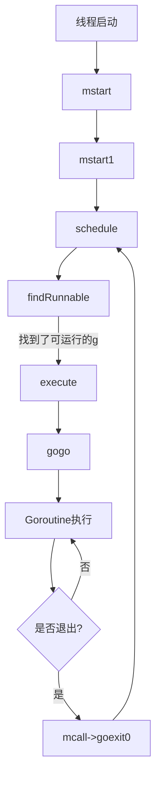

# 工作线程的执行流程与调度循环

> 注：以下所有源码都是基于go1.23.1

## 1. GMP调度器的初始化

**启动阶段由 `runtime·rt0_go`(核心启动函数) 汇编函数调用**，调用顺序为：

1. **`runtime·osinit`**：获取系统信息（如CPU核心数）
2. **`runtime·schedinit`**：初始化调度器。
3. **`runtime·newproc`**：创建主Goroutine（执行 `runtime.main`）。
4. **`runtime·mstart`**：启动调度循环。


### 1.1 osinit

对于 Linux 来说，osinit 函数功能就是获取操作系统的参数设置，例如：获取 CPU 的核数并放在 global 变量 ncpu 中，后边初始化 P 的数量的时候会用到。

> 源码位置：runtime/asm_amd64.s 348

```asm
CALL	runtime·osinit(SB) 
```

> 源码位置：runtime/os_linux.go 343

```go
func osinit() {
	ncpu = getproccount()
	physHugePageSize = getHugePageSize()
	osArchInit()
}
```


### 1.2 schedinit

> 源码位置：src/runtime/proc.go 782

在Go语言运行时中，`func schedinit()` 是调度器初始化的核心方法，负责构建GMP（Goroutine-M-Processor）模型的基础环境。

```go
// golang的启动流程
// The bootstrap sequence is:
//
//	call osinit
//	call schedinit
//	make & queue new G
//	call runtime·mstart
//
// The new G calls runtime·main.
func schedinit() {
    // 一些lock(锁)的初始化
    ...

    // getg 函数在源代码中没有对应的定义，由编译器插入代码
    // get_tls(CX)
	// MOVQ	g(CX), BX
	gp := getg()  // 获取当前 tls 中的 g, 目前是 g0

    ...

	sched.maxmcount = 10000 // 设置最多启动 10000 个操作系统线程，也是最多 10000 个M
    
    ...

    // 栈、内存分配器相关初始化
	stackinit() // 初始化栈
	mallocinit() // 初始化内存分配器

    ...
    
    // 初始化当前系统线程 M0
	mcommoninit(gp.m, -1)
    
    ...

	goenvs() // 初始化go环境变量
    
    ...
    
	gcinit() // 初始化 GC

	...

	lock(&sched.lock)
	sched.lastpoll.Store(nanotime()) // 初始化上次网络轮询的时间
	procs := ncpu //系统中有多少核，就创建和初始化多少个 P 结构体对象
	if n, ok := atoi32(gogetenv("GOMAXPROCS")); ok && n > 0 {
		procs = n // 设置 P 的个数为 GOMAXPROCS 
	}
    // procresize 创建和初始化全局变量 allp
	if procresize(procs) != nil {
		throw("unknown runnable goroutine during bootstrap")
	}
	unlock(&sched.lock)
    
    ...
}
```

schedinti 函数主要逻辑：

1. 初始化各种锁
2. 设置 M 最大数量为 10000
3. 堆栈内存分配器相关初始化
4. **调用mcommoninit函数初始化当前系统线程M0**
5. 设置命令行参数、go环境变量
6. 初始化GC
7. 将 P 个数设置为 GOMAXPROCS 的值，即程序能够同时运行的最大处理器数
8. **调用 procresize 函数创建和初始化全局变量 allp**


#### 1.2.1  mcommoninit

`mcommoninit(gp.m, -1)` 函数主要是初始化 m0 的一些属性，并将 m0 放如全局链表 allm 之中；

> 源码位置：src/runtime/proc.go 924

```go
//预分配ID可以作为‘ ID ’传递，也可以通过传递-1省略。
func mcommoninit(mp *m, id int64) {
    ...

	lock(&sched.lock)

    // 初始化 m 的 id 属性
	if id >= 0 {
		mp.id = id
	} else {
        // 检查已创建系统线程是否超过了数量限制（10000）
        // id 在 sched.mnext 存着
		mp.id = mReserveID()
	}

	...

	mpreinit(mp)  // 创建用于信号处理的 gsignal,从堆上分配一个 g 结构体对象，并设置栈内存
	if mp.gsignal != nil {
		mp.gsignal.stackguard1 = mp.gsignal.stack.lo + stackGuard
	}

	// Add to allm so garbage collector doesn't free g->m
	// when it is just in a register or thread-local storage.
	mp.alllink = allm // 把 m 挂入全局链表 allm 之中

    ...
    
	unlock(&sched.lock)
    
    ...
}
```


#### 1.2.2 procresize(procs)

`procresize(procs)` 函数会创建和初始化p结构体对象、初始化全局变量 allp；

创建指定个数的 p 结构体对象，放在 allp中，并把 m0 和 allp[0] 绑定起来(后续 m0 就不需要绑定 p 了)

> 源码位置：src/runtime/proc.go 5683

```go
func procresize(nprocs int32) *p {
	...

	old := gomaxprocs // 系统初始化时 old = gomaxprocs = 0

    ...

	// Grow allp if necessary.
    // 初始化时 len(allp) == 0
	if nprocs > int32(len(allp)) {
		// Synchronize with retake, which could be running
		// concurrently since it doesn't run on a P.
		lock(&allpLock)
		if nprocs <= int32(cap(allp)) {
            // 用户代码对 P 数量进行缩减
			allp = allp[:nprocs]
		} else {
            // 这里是初始化
			nallp := make([]*p, nprocs)
			// 将所有内容复制到 allp 的上限，这样我们就不会丢失旧分配的 P。
			copy(nallp, allp[:cap(allp)])
			allp = nallp
		}
		...
		unlock(&allpLock)
	}

	// initialize new P's
    // 循环创建新 P，直到 nprocs 个
	for i := old; i < nprocs; i++ {
		pp := allp[i]
		if pp == nil {
			pp = new(p)
		}
		pp.init(i) // 初始化 p 属性，设置 pp.status = _Pgcstop
		atomicstorep(unsafe.Pointer(&allp[i]), unsafe.Pointer(pp))
	}

	gp := getg() // g0
	if gp.m.p != 0 && gp.m.p.ptr().id < nprocs {
		// continue to use the current P
		gp.m.p.ptr().status = _Prunning
		gp.m.p.ptr().mcache.prepareForSweep()
	} else {
        // 初始化会走这个分支
		...
		gp.m.p = 0
		pp := allp[0]
		pp.m = 0
		pp.status = _Pidle // 把 allp[0] 设置为 _Pidle
		acquirep(pp) // 把 allp[0] 和 m0 关联起来，设置为 _Prunning
		...
	}

	...

	var runnablePs *p
    // 下面这个for 循环把所有空闲的 p 放入空闲链表
	for i := nprocs - 1; i >= 0; i-- {
		pp := allp[i]
		if gp.m.p.ptr() == pp { // allp[0] 保持 _Prunning
			continue
		}
		pp.status = _Pidle // 初始化其他 p 都为 _Pidle
		if runqempty(pp) {
			pidleput(pp, now) // 放入 sched.pidle P 空闲链表，都是链表操作
		} else {
			...
		}
	}

    ...
    
	return runnablePs
}
```

procsize函数初始化的主要流程：

1. 使用 make([]*p, nprocs) 初始化全局变量 allp，即 `allp = make([]*p, nprocs)`；
2. 循环创建、初始化 nprocs 个 p 结构体对象，此时 p.status = _Pgcstop，依次保存在 allp 切片之中；
3. 先把 allp[0] 状态设置为 _Pidle，然后把 m0 和 allp[0] 关联在一起，即 m0.p = allp[0] , allp[0].m = m0，此时设置 allp[0] 的状态 _Prunning；
4. 循环 allp[0] 之外的所有 p 对象，设置 _Pidle 状态，并放入到全局变量 sched 的 pidle 空闲队列之中，链表使用 p.link 进行连接。


### 1.3 newproc

newproc 函数作用是创建一个 goroutine

> 源码位置：src/runtime/proc.go 4974

```go
// Create a new g running fn.
// Put it on the queue of g's waiting to run.
// The compiler turns a go statement into a call to this.
func newproc(fn *funcval) {
	gp := getg()
	pc := getcallerpc() // 获取 newproc 函数调用者指令的地址
	systemstack(func() {
		newg := newproc1(fn, gp, pc) // 创建 G

		pp := getg().m.p.ptr() // 获取当前绑定的 p
		runqput(pp, newg, true) // 将 G 放入运行队列

		if mainStarted { // 如果main函数已经启动, 则需要唤醒一个p
			wakep()
		}
	})
}
```

使用 `systemstack ` 函数切换到系统栈 (一般是g0栈) 中执行，执行完毕后切换回普通 g 的栈；

`newproc1` 函数是Go语言运行时系统中用于创建新 goroutine 的核心函数；负责初始化一个新的 `g` 结构体，并将其放入可运行队列等待调度执行；

```go
// 在状态_Grunnable（如果parking为true，则为_Gwaiting）中创建一个新的g，从fn开始。
// 将创建的 g 加入到调度器中
// 参数:
// fn *funcval: 待执行的函数指针
// callergp *g: 调用方的goroutine
func newproc1(fn *funcval, callergp *g, callerpc uintptr, parked bool, waitreason waitReason) *g {
	if fn == nil {
		fatal("go of nil func value")
	}

    // 取当前 g0 绑定的 m, 并将对其上锁(禁止抢占，防止在分配过程中被调度打断)
    // 返回 m
	mp := acquirem()  
    
    // 取出 m 绑定的 p
	pp := mp.p.ptr()
    
    // 尝试从 p 的空闲列表获取一个空闲的 g, 若取不到则新建一个, 并添加到allg中
    // 尝试从 p 本地 gFree 或 schedt 结构中全局 gFree 中获取 Gdead 状态的 g
    // gFree 队列是所有已退出的 goroutine 对应的 g 结构体组成的链表, 用于缓存 g 结构体对象, 避免每次创建 goroutine 时都重新分配内存(复用减少内存分配)
	newg := gfget(pp)
	if newg == nil {
		newg = malg(stackMin) // 创建一个新的 g, 为其分配stackMin大小的栈空间
		casgstatus(newg, _Gidle, _Gdead) // 初始状态设为 _Gdead
		allgadd(newg) // 添加到全局 allg 列表，避免被 GC 回收
	}
    
    // 检查新创建的g的栈是否正常
	if newg.stack.hi == 0 {
		throw("newproc1: newg missing stack")
	}
	
    // 检查新创建的g的状态是否正常
	if readgstatus(newg) != _Gdead {
		throw("newproc1: new g is not Gdead")
	}

    totalSize := uintptr(4*goarch.PtrSize + sys.MinFrameSize) // 计算参数所需空间
    totalSize = alignUp(totalSize, sys.StackAlign)  // 按8字节对齐(64位操作系统)
	sp := newg.stack.hi - totalSize // 栈顶预留空间存放参数
    
    ...

    // 清除新分配的内存(两个参数:起始地址, 长度) ---> 快速初始化新g的sched空间
	memclrNoHeapPointers(unsafe.Pointer(&newg.sched), unsafe.Sizeof(newg.sched))
    
	newg.sched.sp = sp // 栈指针指向参数区顶部
	newg.stktopsp = sp
	newg.sched.pc = abi.FuncPCABI0(goexit) + sys.PCQuantum  // PC 指向 goexit 第二条指令
	newg.sched.g = guintptr(unsafe.Pointer(newg)) // 绑定自身 g 结构体
	gostartcallfn(&newg.sched, fn) // 伪造调用链：fn -> goexit
    
	newg.parentGoid = callergp.goid
	newg.gopc = callerpc // 记录创建者的调用位置（调试用）
	newg.ancestors = saveAncestors(callergp)  
	newg.startpc = fn.fn // 记录用户函数入口

    ...
    
    var status uint32 = _Grunnable
	if parked {
		status = _Gwaiting
		newg.waitreason = waitreason
	}
    casgstatus(newg, _Gdead, status) // 状态切换为可运行(_Grunnable)
    
    ...
    
    // 分配goid
	newg.goid = pp.goidcache
	pp.goidcache++
    
    ...
    
    // 将当前 m 的引用计数减1，解除当前 goroutine 与 m 的绑定关系，使该 m 可被其他 goroutine 复用, 与上面acquirem方法协作使用
	releasem(mp)

	return newg
}
```

`newg.sched.pc = abi.FuncPCABI0(goexit) + sys.PCQuantum`：`newg.sched.pc` 被设置成了 `goexit` 函数的第二条指令的地址而不是 `fn.fn`，具体原因要分析`gostartcallfn `函数：

```go
// adjust Gobuf as if it executed a call to fn
// and then stopped before the first instruction in fn.
func gostartcallfn(gobuf *gobuf, fv *funcval) {
	var fn unsafe.Pointer
	if fv != nil {
		fn = unsafe.Pointer(fv.fn)
	} else {
		fn = unsafe.Pointer(abi.FuncPCABIInternal(nilfunc))
	}
	gostartcall(gobuf, fn, unsafe.Pointer(fv))
}

// adjust Gobuf as if it executed a call to fn with context ctxt
// and then stopped before the first instruction in fn.
func gostartcall(buf *gobuf, fn, ctxt unsafe.Pointer) {
	sp := buf.sp // newg 的栈顶
	sp -= goarch.PtrSize // 栈顶向下移动 8 字节，用来存 return address
	*(*uintptr)(unsafe.Pointer(sp)) = buf.pc // return address =  goexit 函数的第二条指令的地址
	buf.sp = sp // 设置 buf.sp 指向新的栈顶
	buf.pc = uintptr(fn) // buf.pc 执行函数地址 fn，后边 g 被调度起来，会从这里开始执行
	buf.ctxt = ctxt 
}

```

gostartcallfn 函数首先从参数 fv 中提取出函数地址 fv.fn，然后继续调用 gostartcall 函数。

gostartcall 函数的主要作用有两个：

1. 整 newg 的栈空间，把 goexit 函数的第二条指令的地址入栈，伪造成 goexit 函数调用了 fn 的假象，从而使 fn 执行完成后，执行 ret 指令时，返回到 goexit+1 处继续执行，完成最后的清理工作；
2. 重新设置 newg.buf.sp 指向新栈顶，设置 newg.buf.pc 为需要执行的函数的地址，即 fn，也就是 go 关键字后边的函数的地址。至此，一个可用的 goroutine 就创建好了。


### 1.4 mstart
